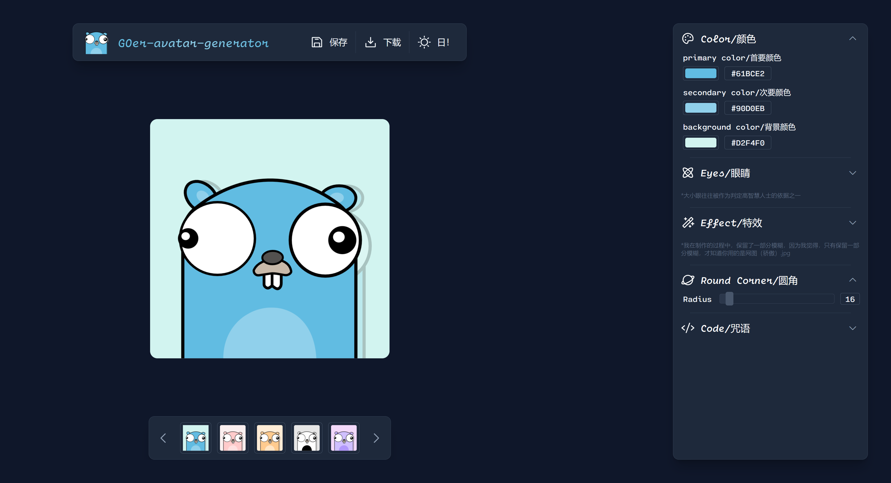
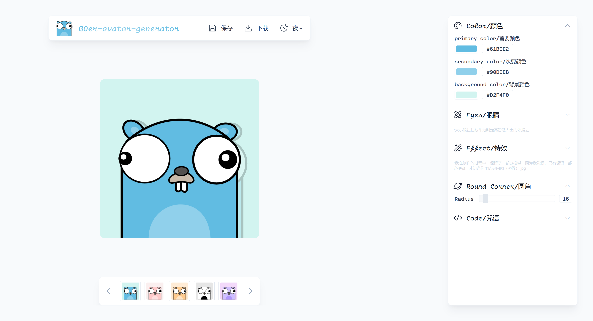
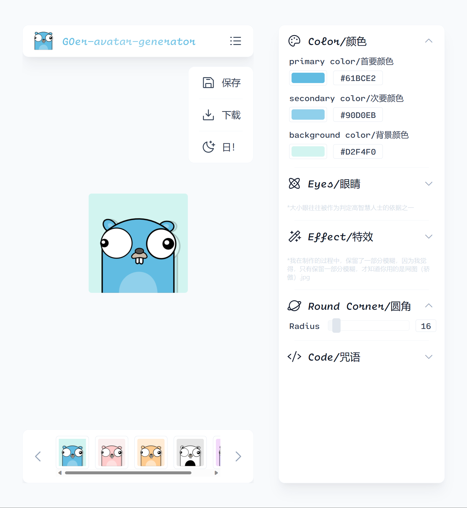
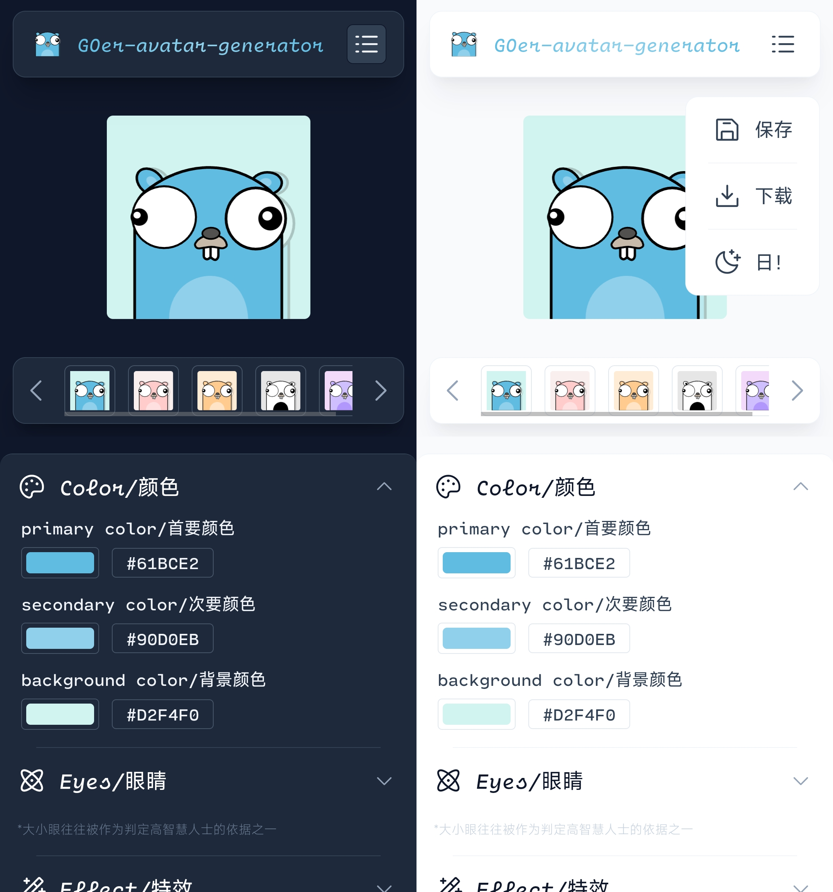

# GOer-avatar-genrator

用于生成以 GO 语言吉祥物（一只金花鼠）为主题的头像

## 🚀 来自于

“年轻人的第一个 GO 项目”。本人在学习入门了 GO 之后，一直想着写点什么，于是有了这一个一行 GO 代码也没有的项目。

## 🗝️ 访问

- 项目部署-vercel:
  [GOer-avatar-generator](https://goer-avatar-generator.vercel.app/)
- 设计资源-figma:
  [https://www.figma.com/file/jLbsClfoi4ByRs7Sq1b9d4/GOer-avatar-generator?node-id=0%3A1&t=CQO3Bi1IAqUSKQHj-1](https://www.figma.com/file/jLbsClfoi4ByRs7Sq1b9d4/GOer-avatar-generator?node-id=0%3A1&t=CQO3Bi1IAqUSKQHj-1)
- 文档-notion
  [GOer-avatar-genrator](https://candied-soy-d64.notion.site/GOer-avatar-genrator-7ccf60e2b02d40d19e2a6e3768dfa147)

## 🎨 界面设计

包含响应式布局，适配了桌面端和移动端。此外也提供了深色和浅色两套主题供选择

- 笔记本端/全屏
  - 深色模式
    
  - 浅色模式
    
- 笔记本端/半屏
  - 浅色模式
    
- 移动端
  

## 🪄 技术栈

我希望这个应用尽可能的轻量小巧

- vue3
- tailwind.css
- TypeScript
